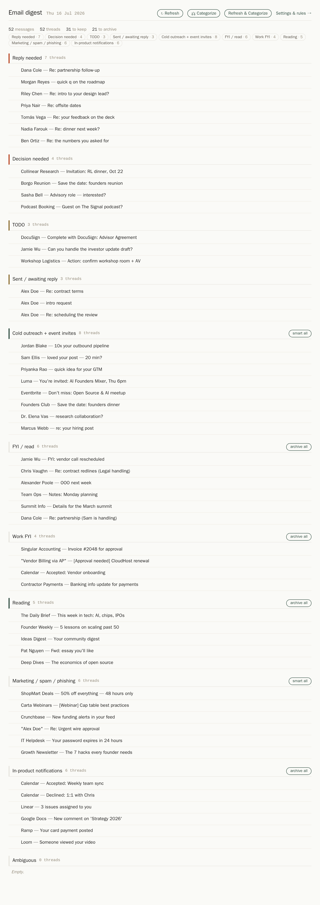
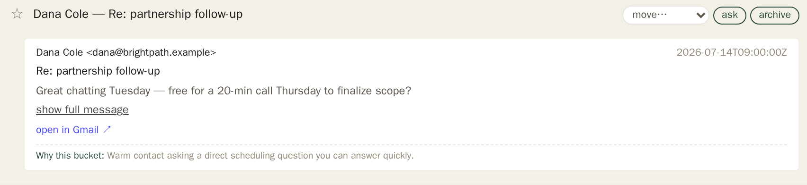
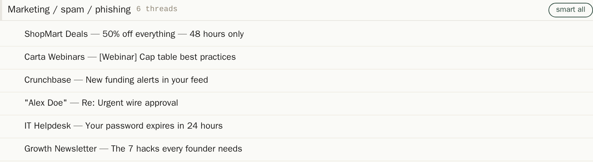
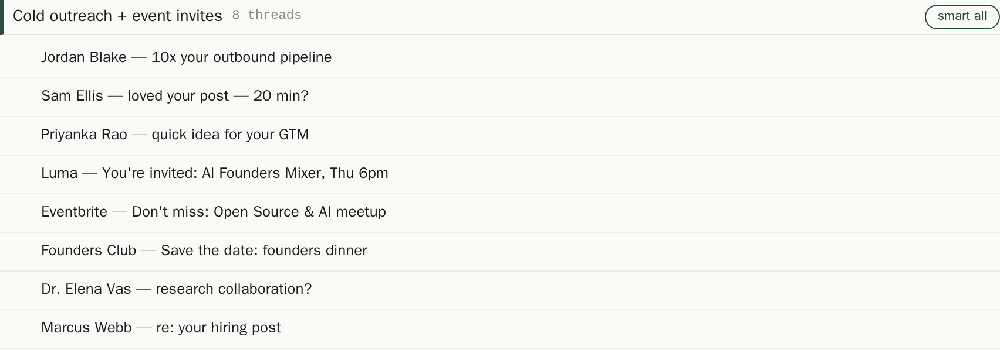

# Inbox Digest & Review

A Gmail inbox digest and one-click triage app. It turns a noisy inbox into a
scannable digest grouped by *what actually needs doing* — reply-needed,
decisions pending, what you're waiting on, cold outreach, newsletters, pure
noise — rendered as a web page you open like any other tab.

Instead of scrolling a flat list, you see every message sorted into an
actionable bucket with a one-line, human-readable summary, and you clear each
item in a single click: archive, mark spam, unsubscribe, or mute. It learns
from how you triage, so the sorting gets better over time.

> This is a **Minds inspiration** — a bootable snapshot of an app one mind
> built, published so another mind can be created *from* it. It ships with a
> `welcome` skill that walks a new user through connecting their own Gmail and
> adapting the app to their inbox. See [Adopting this](#adopting-this) below.
> The screenshots on this page use entirely fictional sample data.

## The problem it solves

Inbox overload isn't about volume, it's about *undifferentiated* volume — a
reply you owe a colleague sits in the same flat list as a 50%-off blast and a
calendar notification. This app does the sorting for you: it reads your entire
unarchived inbox, classifies every message into one of ten actionable
categories, writes a plain-English one-liner for each, and gives you a single
surface to clear them from — grouped, prioritized, and browsable.

## How it works

Two parts:

- **The `email-digest` skill does the thinking.** It pulls recent Gmail,
  classifies every message using Gmail's own category labels plus content-aware
  rules (with an optional LLM self-review pass for the tricky ones), writes a
  one-line summary per message, and saves the result to a digest data file.
- **The `email-review` web app is the surface.** A small FastAPI service reads
  that file and renders the triage UI (no build step — HTML/CSS/JS inline). Its
  one-click action buttons perform the Gmail writes directly against the Gmail
  API. You open it as a tab, scan by category, expand any message to read it
  (rendered as real HTML, with tracking pixels stripped), and clear the
  buckets — with an undo toast on every action.

## The ten buckets

Every inbox message lands in exactly one, in priority order:

1. **Reply needed** — someone you know asked you a direct question you can
   answer quickly.
2. **Decision needed** — an invitation or opportunity to say yes/no to.
3. **FYI / read** — you're looped in, but nobody's waiting on you.
4. **TODO** — real work that lands on your plate (including things to sign).
5. **Sent / awaiting reply** — your outgoing mail that hasn't been answered.
6. **Cold outreach + event invites** — strangers reaching out, and invites you
   might want to attend (kept browsable on purpose).
7. **Marketing / spam / phishing** — automated blasts and impersonation
   attempts.
8. **In-product notifications** — calendar accepts, SaaS comments, payment
   notices.
9. **Reading** — newsletters and things you opted into.
10. **Work FYI** — company-process automation (invoices, AP-forwarded mail).

The taxonomy is opinionated by design — it's a starting point you tune to your
own inbox (see [Adopting this](#adopting-this)).

## One-click triage

Open any message to read it in place, with the actions right there — move it to
a different bucket, ask about it, or archive — plus a note explaining *why* the
classifier put it where it did:

**Marketing, spam, and phishing are separated from real people.** Impersonation
(a display name pretending to be you, an urgent wire request) and
credential-harvest lures are flagged here rather than mixed in with genuine cold
outreach:

**Cold outreach and event invites stay browsable together** — you're less
likely to dig through the spam pile, so real event invites are routed here
instead, alongside genuine cold pitches, ready to scan and act on in bulk:

## It learns from how you triage

The classifier is never final. Every time you move a message to a different
bucket, the app records a labeled correction — who the mail is from, its
subject and content, the bucket the classifier chose and why, and where you
moved it. A daily job (`scripts/review_email_moves.py`) mines those corrections
for repeated patterns and, when it finds one, messages you with a concrete
proposal:

> Your inbox digest has been learning from how you sort your mail. A couple of
> patterns stood out this week:
> 1. You keep moving newsletters from The Daily Brief into Reading — want me to
>    always file them there?
> 2. You've moved several emails from anyone at acme-legal.com into
>    reply-needed — should I treat that domain as a real contact so they always
>    surface?
>
> Reply with the numbers to apply (or "all"/"none"). Nothing changes to how
> your mail is sorted until you confirm.

Nothing is ever auto-applied — every rule change waits for your approval.

## Adopting this

This repo is a bootable snapshot. When a new mind is created from it, the
`welcome` skill runs on the first turn and walks you through setup:

- **Connect Gmail.** The agent requests read + write access to your Gmail (read
  builds the digest; write performs the one-click actions). Approve it once.
- **Identity + contacts, filled for you.** You never hand-edit a config file.
  The agent writes your name and addresses into the account config, then mines
  your own sent mail to build your who's-who allowlist and shows it to you for
  a quick confirm — so the very first digest is sorted correctly instead of
  treating everyone as a stranger.
- **Tune the taxonomy.** The agent asks once whether the ten buckets fit, makes
  any edits for you, and from then on improves the rules from your moves via
  the daily loop above.

The full adaptation guide lives in
[`inspiration-inbox-digest-review.md`](inspiration-inbox-digest-review.md) —
the manifest an adopting agent reads to present and adapt this app.

### Prerequisites

- A Gmail account (accessed through the Minds credential gateway; no API key to
  provision).
- The classifier's LLM steps use the template's built-in keyless `claude -p`
  helper, so there's nothing else to set up.

## What ships here

- `libs/email_review` — the FastAPI web service and the Gmail action layer.
- `.agents/skills/email-digest` — the classifier, rules (`RULES.md`), the
  who's-who allowlist (`contacts.txt`), and the LLM self-review judge.
- `scripts/review_email_moves.py` — the daily learn-from-moves miner.
- `inspiration-inbox-digest-review.md` — the adoption manifest.

Everything ships with obvious placeholder identity and contacts (a fictional
"Alex Doe" on `.example` domains); the app runs immediately and the onboarding
flow replaces them with yours.
