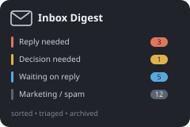

  

# Inbox Digest & Review

  

Didn't work? Create a Minds workspace and paste this to your agent:
` /use-template https://github.com/MINDS_TEMPLATE_REPO_URL`

## Why you care

A Gmail inbox digest and one-click triage app: a skill classifies recent mail into a 10-bucket taxonomy, and a web view lets you read and clear each item (archive / spam / unsubscribe / mute).

A cluttered inbox hides the handful of messages that actually need a reply
behind hundreds of newsletters, receipts, and cold outreach. This turns that
into a single page: everything currently in the inbox, already sorted by what
it actually needs from you, cleared with one click per thread instead of one
scroll at a time.

## How to use it

Ask your agent to "build my inbox digest" (or just open the app). Behind the
scenes it runs the `email-digest` skill, which pulls everything currently in
your inbox and sorts each thread into one of ten buckets:

- **Reply needed** / **Decision needed** / **TODO** -- things only you can
  move forward
- **Sent / awaiting reply** -- your own outgoing threads nobody has answered
- **Cold outreach + event invites**, **FYI / read**, **Work FYI**, **Reading**
- **Marketing / spam / phishing**, **In-product notifications** -- the noise

The web view groups every thread by bucket. For each one:

- **Archive**, **Mark spam**, **Mute**, or **Unsubscribe** -- one click,
  straight against your real Gmail account, and every action is undoable
- Buckets 6/7 also get a **smart-action** button that picks the right one of
  those four for you (never clicks a phisher's unsubscribe link, never
  unsubscribes you from your own company's mailing list)

Hit **Refresh** or **Categorize** to re-run the pipeline against your current
inbox. `contact_audit.py` (run monthly) keeps your who's-who list current so
the classifier stops guessing about repeat senders.

## Ideas for making it yours

- Add a Slack pull step alongside Gmail, so DMs and mentions land in the same
  digest (the classifier's label/content-pass structure already generalizes).
- Schedule the digest to rebuild automatically every morning instead of only
  on demand.
- Add a weekly instead of daily "cold outreach" rollup for buckets 6/7, if
  daily is more noise than signal for your inbox.
- Wire a second AP-forwarder or shared inbox address into the smart-action
  ruleset if you route invoices through more than one address.
- Add plain Gmail draft replies for the "Reply needed" bucket, so you can
  start a response from inside the triage view instead of switching to Gmail.

## What this is

This repository is a published **minds template**: a clean, bootable
snapshot of what a mind built, ready to adapt into your own. It is NOT the
generic workspace template -- it is this specific project.

[`template.md`](template.md) is the full manifest -- what it is, how it
works, what it needs to run, and what to adapt -- with the
machine-readable half (recipe, requirements, and the environment it needs
installed) in [`template.toml`](template.toml).
